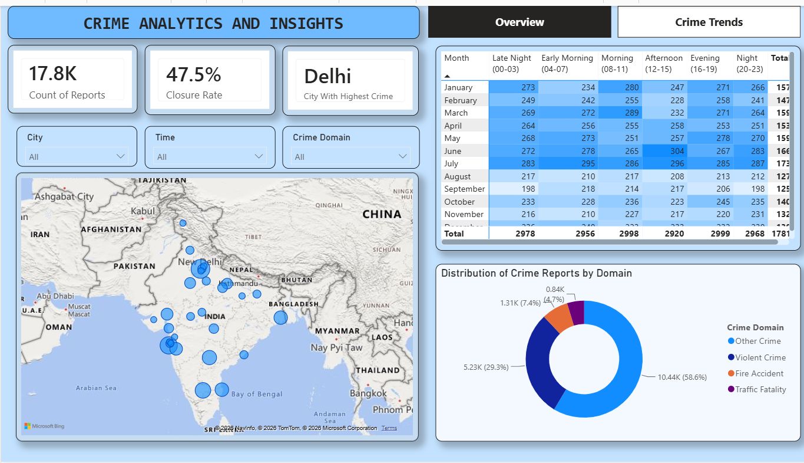

# 🚔 Crime Analytics and Insights Dashboard

An interactive **Power BI dashboard** built to analyze crime data across various Indian cities. This project transforms raw crime records into meaningful visualizations, enabling users to identify crime trends, hotspots, demographic patterns, weapon usage, and law enforcement insights through an intuitive Business Intelligence dashboard.

---

## 📖 Project Overview

Crime data often contains thousands of records that are difficult to interpret using spreadsheets alone. This project leverages **Power BI**, **Power Query**, and **DAX** to create a dynamic dashboard that simplifies complex crime data into actionable insights.

The dashboard allows users to:

- Analyze crime distribution across cities
- Explore annual and monthly crime trends
- Monitor crime closure rates
- Identify crime hotspots using maps
- Study weapon usage patterns
- Compare crime domains
- Analyze victim demographics
- Evaluate police deployment across different crime types

---

## 📊 Dashboard Preview

### 🏠 Overview Dashboard

Features:

- Total Crime Reports
- Crime Closure Rate
- City with Highest Crime
- Interactive Filters (City, Time, Crime Domain)
- Geographic Crime Distribution Map
- Monthly Crime Heatmap
- Crime Domain Distribution



---

### 📈 Crime Trends Dashboard

Features:

- Most Common Weapon
- Female Crime Count
- Average Victim Age
- Annual Crime Trend
- Police Deployment Analysis
- Weapon Usage Distribution
- Top 5 Crime Categories
- Gender-wise Crime Comparison


---

# 📂 Dataset

The dataset consists of **17,819 crime records** collected for analytical purposes.

### Dataset Attributes

| Column | Description |
|---------|-------------|
| Report Number | Unique report identifier |
| Date Reported | Date when the crime was reported |
| Date of Occurrence | Date the crime occurred |
| Time of Occurrence | Time of occurrence |
| City | Location of the crime |
| Crime Code | Crime classification code |
| Crime Description | Description of the crime |
| Victim Age | Age of the victim |
| Victim Gender | Gender of the victim |
| Weapon Used | Weapon involved (if any) |
| Crime Domain | Category of crime |
| Police Deployed | Number of police personnel deployed |
| Case Closed | Whether the case is closed |
| Date Case Closed | Case closure date |

---

# 📈 Key Performance Indicators (KPIs)

The dashboard tracks important metrics including:

- 📌 Total Crime Reports
- 📌 Crime Closure Rate
- 📌 City with Highest Crime
- 📌 Most Common Weapon
- 📌 Female Crime Count
- 📌 Average Victim Age

---

# 📊 Visualizations Used

- KPI Cards
- Interactive Slicers
- Bubble Map
- Heatmap Matrix
- Donut Chart
- Pie Chart
- Line Chart
- Clustered Column Chart
- Multi-page Navigation

---

# 🛠 Technologies Used

- **Power BI Desktop**
- **Power Query**
- **DAX**
- **Microsoft Bing Maps**
- Data Modeling
- Interactive Visualizations

---

# 📌 Insights Generated

Some of the insights provided by the dashboard include:

- City with the highest number of reported crimes.
- Overall crime closure percentage.
- Crime distribution across different domains.
- Monthly crime patterns.
- Peak crime timings during the day.
- Most commonly used weapons.
- Crime categories requiring higher police deployment.
- Gender-wise distribution of victims.
- Yearly crime trends.

---

# 📁 Repository Structure

```
Crime-Analytics-Dashboard/
│
├── Crime_Analytics.pbix
├── crime_dataset_india.csv
├── README.md
│
├── screenshots/
│   ├── crime-overview.png
│   └── crime_trends.png
│
└── assets/
```

---

# 🚀 Getting Started

### Clone the repository

```bash
git clone https://github.com/yourusername/Crime-Analytics-Dashboard.git
```

### Open the project

1. Install **Power BI Desktop**
2. Open `Crime_Analytics.pbix`
3. Refresh the dataset if required.
4. Explore the dashboard using the interactive filters.

---

# 💼 Skills Demonstrated

- Business Intelligence
- Data Cleaning
- Data Transformation
- Data Modeling
- DAX Measures
- Dashboard Design
- Interactive Reporting
- Data Visualization
- Geospatial Analysis
- KPI Development

---

# 🎓 Learning Outcomes

Through this project, I gained practical experience in:

- Designing business intelligence dashboards
- Building data models in Power BI
- Creating calculated columns and DAX measures
- Using Power Query for ETL operations
- Developing interactive reports
- Presenting actionable insights through visual storytelling

---

# 🤝 Contributing

Contributions, suggestions, and feedback are welcome!

Feel free to fork this repository and submit a pull request.

---

# 📜 License

This project is intended for educational and portfolio purposes.

---

## ⭐ If you found this project helpful, consider giving it a star!
